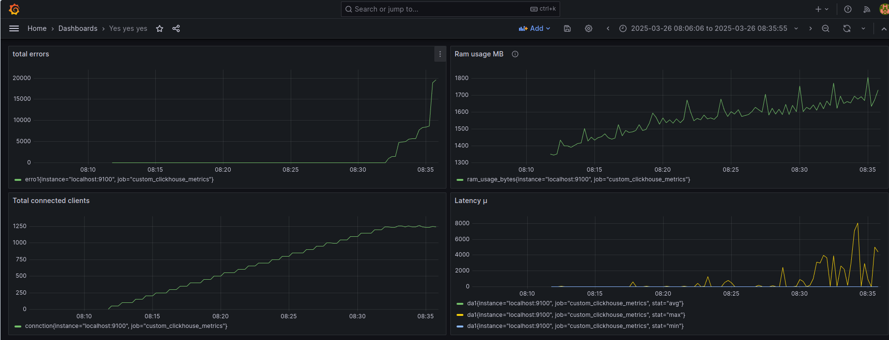

# How was testing performed

A little annotation: its quite immature test, because the framework isnt ready and in the end its just a tiny wrapper around `tokio` Tcp.

## Key points of testing
- How many clients can it handle
- What are the average, minimum and maximum latencies are
- What is the memory usage
- When does it start to fail

## How was testing performed
There were 3 main parts of testing:
1. The `Pinguino` server
2. The loader (which is based on pinguino Client)
3. The collector (`Prometheus` which was collecting data from `clickhouse` db via `python` script)

Every minute 50 new clients were connected to the server by loader.
Client action was simple: `Bind` name with pattern "Jeff{loader_iteration_index}", start `Handshake` and every 1.2ms send message with pattern "Hello world!{loader_iteration_index}".

## How latency was measured
Latency was measured poorely. `Instant::now()` was attached to the `State.varmap` inside of `StartingBytesware` and elapsed inside of `EndingBytesware`. Its not fair measurement, and in the next test it should be measured client-side from when request was sent to when it was recieved.

Average, Minimum and Maximum were just queried from `Clickhouse` via sql.

## How total clients was measured
It was measured via `AtomicU32` server side. When `BeforeWare` (it is called when connection is recieved) is triggred it was calling increment and when `AfterWare` (it is called when connection is stopped) calling decrement.

## How total memory was measured
It was measured via `sysinfo` library.

## Hardware
The hardware this exact test was ran on - ryzen 5800x, 32gb 3200 mhz ddr4.

## Test results 

Managed to get up to 1200 clients inside of one room, that were writing every 1.2ms and recieving messages from **all** of the other clients. Average latency was around 24. minimum latency was beween 0 and 1 **MICRO** second (because of how poorely was latency measured i guess), maximum latency was around 8ms by graph, but i remember there was one with 32ms.

This test was more of the cool thing to do - setting prometheus, grafana and clickhouse was very fun, but i need to learn observability first, before ever doing it again.

## Why was test performed anyway
I need something to compare results in the future. Yes, testing would probably be done in better quality, and they wont be relevant to each other.